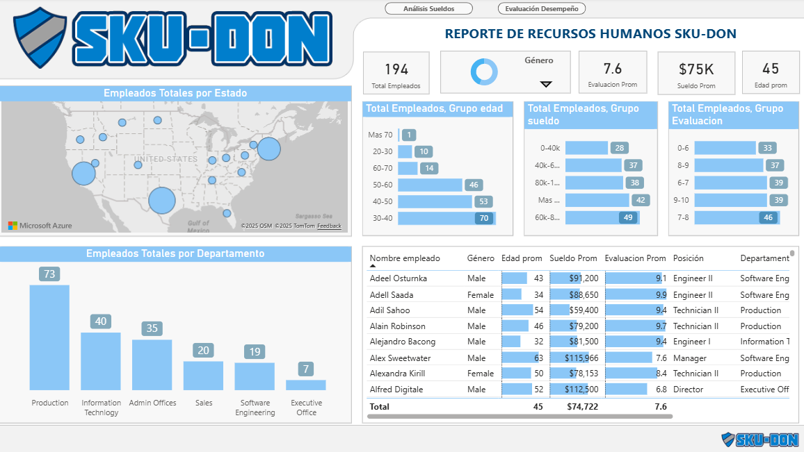
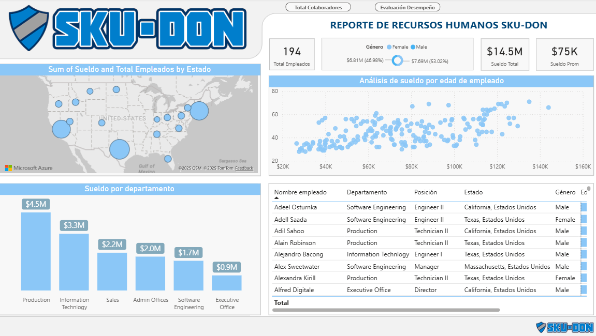
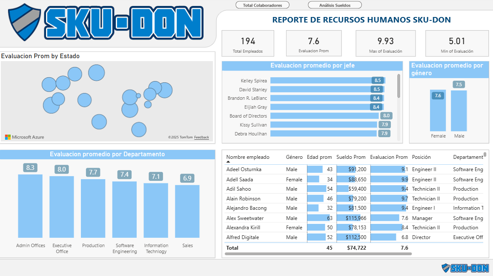

# 📊 Proyecto: Dashboard de Recursos Humanos – SKU-DON

## 🚀 Descripción
Este proyecto presenta un **Dashboard interactivo desarrollado en Power BI** para el área de Recursos Humanos de la empresa ficticia **SKU-DON**.  
El objetivo principal es analizar y visualizar datos relacionados con los empleados, permitiendo identificar patrones en:
- Distribución geográfica.
- Sueldos promedio.
- Evaluaciones de desempeño.
- Edad promedio.
- Composición por género y departamentos.

Con este dashboard se busca optimizar la **gestión del talento humano** y facilitar la toma de decisiones estratégicas.

---

## 🖼️ Vista previa del Dashboard
### Imagen general:
()

>   
- **Análisis de sueldo**  

- **Evaluaciones de desempeño**  
- 

---

## 📂 Contenido del Repositorio
- `README.md` → Documentación principal del proyecto.  
- `images/` → Carpeta con capturas del dashboard.  
- `data/` → Datos utilizados para construir el reporte (si puedes compartirlos).  
- `Proyecto 3.pbix` → Archivo del dashboard en Power BI (si decides subirlo).  

---

## ⚙️ Tecnologías Utilizadas
- **Power BI** → Visualización y construcción del dashboard.  
- **Microsoft Azure Maps** → Para geolocalización de empleados.  
- **Excel / CSV** → Fuente de datos para simulación.  

---

## 📊 Principales Insights del Dashboard
- **Total empleados**: 194  
- **Edad promedio**: 45 años  
- **Sueldo promedio**: $75K  
- **Evaluación promedio**: 7.6 / 10  
- **Departamento más grande**: Producción (73 empleados)  

---

## 🎯 Objetivo del Proyecto
- Facilitar el **seguimiento de desempeño y sueldos** por departamento.  
- Identificar **concentración geográfica** de empleados.  
- Analizar **equidad de género** y distribución por edades.  
- Proveer una herramienta visual que apoye la **toma de decisiones en RRHH**.  

---

## 📌 Cómo usar este repositorio
1. Descarga el archivo `.pbix`.  
2. Abre el proyecto en **Power BI Desktop**.  
3. Conecta tus propios datos (opcional).  
4. Explora y personaliza el dashboard.  

---

## 👩‍💻 Autor
Creado por **Melissa Peñaloza**  
💼 Estudiante de Ingeniería en Sistemas/ Analista en formación en Business Intelligence y Data Analytics.  
📫 Encuéntrame en LinkedIn como Melissa Peñaloza 
