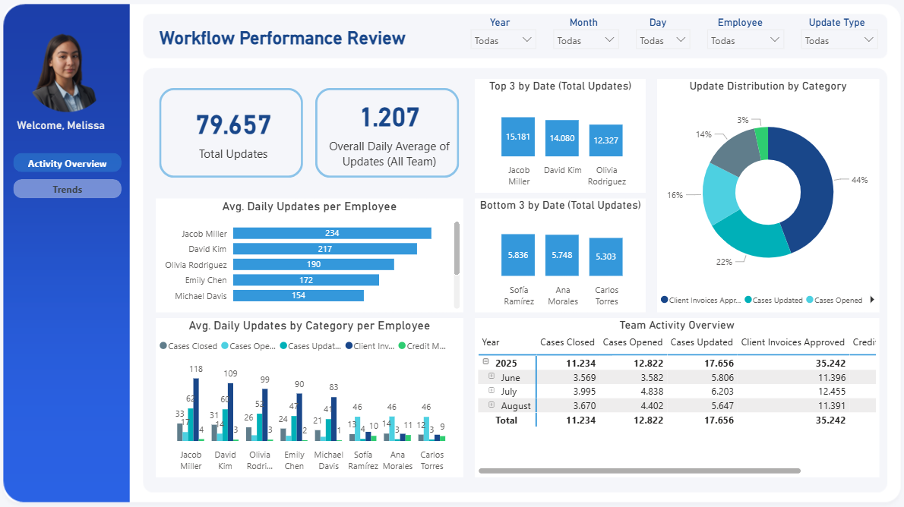
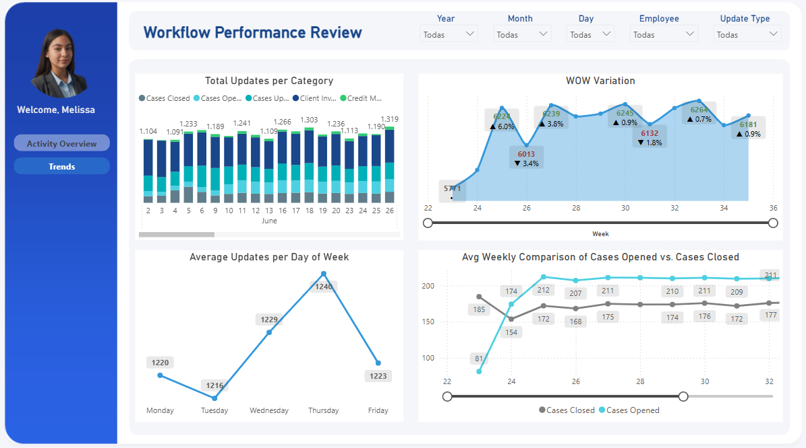

# 📈 Revisión del Rendimiento del Flujo de Trabajo (Workflow Performance Review)

## 📌 Descripción General del Proyecto

Este proyecto consiste en un **Dashboard de Desempeño Operacional y Monitoreo (Operational Performance & Monitoring Dashboard)** desarrollado en Power BI. 

El objetivo principal es ofrecer una visión completa y detallada del rendimiento de las operaciones y el flujo de trabajo de un equipo durante un período inicial de tres meses (Junio-Agosto). El dashboard proporciona al líder del equipo la información necesaria para optimizar procesos, gestionar cargas de trabajo y preparar la transición hacia la atención a un nuevo cliente importante.

---

## 🎯 Caso de Negocio: Preparación para la Expansión

**Contexto:** Un líder de equipo está por iniciar la prestación de servicios a un cliente nuevo y de alto perfil. El equipo ha estado en una fase inicial de generación de datos y establecimiento de procesos durante tres meses y el líder necesita una visión clara de la operación.

**Reto del Negocio:** Entender el estado actual de la operación, el desempeño individual y colectivo, y las tendencias de carga de trabajo para **garantizar una transición exitosa** y **mantener la calidad del servicio** al incorporar el nuevo cliente.

**Mi Rol como Analista:** Fui el encargado de transformar los datos brutos de la operación en información accionable, diseñando un dashboard que respondiera a las preguntas críticas del negocio.

---

## 🧠 Proceso de Desarrollo y Abordaje Analítico

Mi enfoque se centró en la metodología de la **"Visión de 360 Grados del Rendimiento"**, articulada mediante las siguientes preguntas clave (el *framework* de análisis) que definieron la estructura del dashboard:

1.  **¿Qué Pretende Abordar el Dashboard?**
    * Evaluar la eficiencia operativa (ej. ¿Se están procesando las tareas a un ritmo adecuado?).
    * Identificar cuellos de botella y picos de trabajo (¿Cuándo y dónde se presentan los desafíos?).
    * Medir el desempeño individual (¿Cómo se compara el rendimiento de los miembros del equipo?).

2.  **¿Qué Espera Ver el Líder del Equipo?**
    * Métricas de volumen total y promedio de tareas (*updates*).
    * Distribución de la carga de trabajo por categoría (Casos Abiertos/Cerrados, Facturas, Créditos, etc.).
    * Tendencias de la actividad (día a día, semana a semana, mes a mes).

3.  **¿Qué Problemas Potenciales Deben Monitorearse?**
    * Una alta tasa de "Casos Abiertos" sin seguimiento rápido a "Casos Cerrados".
    * Disparidades significativas en el promedio diario de trabajo entre empleados.
    * Variaciones semanales (*WoW Variation*) inestables.

4.  **Recursos y Datos:**
    * Confirmación de la disponibilidad de datos a nivel de transacciones, con *timestamps* y asignaciones de empleado.
    * Definición de las métricas clave: **Total Updates, Overall Daily Average, Avg. Daily Updates per Employee, WoW Variation.**

---

## 🖥️ Estructura del Dashboard y Key Insights

El dashboard se estructura en **dos vistas principales** para una inmersión progresiva en los datos:

### 1. Vista de Rendimiento General (Activity Overview)

Esta vista ofrece el panorama ejecutivo y se centra en la distribución del trabajo:

* **KPIs de Alto Nivel:** Total Updates (79,657) y Overall Daily Average (1,225).
* **Desempeño Individual:** Muestra el *Avg. Daily Updates per Employee*, destacando a los top performers (ej. Jacob Miller con 234).
* **Composición del Trabajo:** El gráfico de distribución revela que **Client Invoices Approved** representa el 44% de la actividad, guiando al líder sobre dónde se concentra el volumen.

### 2. Vista de Tendencias y Estabilidad (Trends)

Esta vista se enfoca en el comportamiento y la planificación futura:

* **Variación Semanal (WoW Variation):** Una métrica crítica de **Estabilidad** que rastrea el cambio porcentual semana a semana, ideal para identificar picos o caídas inesperadas que requieran intervención.
* **Promedio por Día de la Semana:** Se identificó que el *peak* de trabajo es el **Jueves** (1,240 actualizaciones). Este insight es crucial para la planificación de recursos.
* **Comparación Semanal (Casos Abiertos vs. Cerrados):** Permite al líder monitorear la salud del flujo de trabajo, asegurando que los casos se cierren a un ritmo sostenible.

---

## 🛠️ Habilidades Técnicas y Herramientas

* **Herramienta Principal:** Power BI Desktop
* **Modelado de Datos:** Implementación de un modelo de datos optimizado.
* **Lenguaje:** **DAX** para la creación de métricas complejas (ej. *WoW Variation*, Proemdio Diarios, etc.) y cálculos de rendimiento.
* **Visualización:** Diseño UI/UX enfocado en la claridad para la toma de decisiones ejecutivas y la narración de datos (*Data Storytelling*).

---

## 📞 Contacto

Si tienes preguntas sobre la metodología o el desarrollo, no dudes en contactarme.